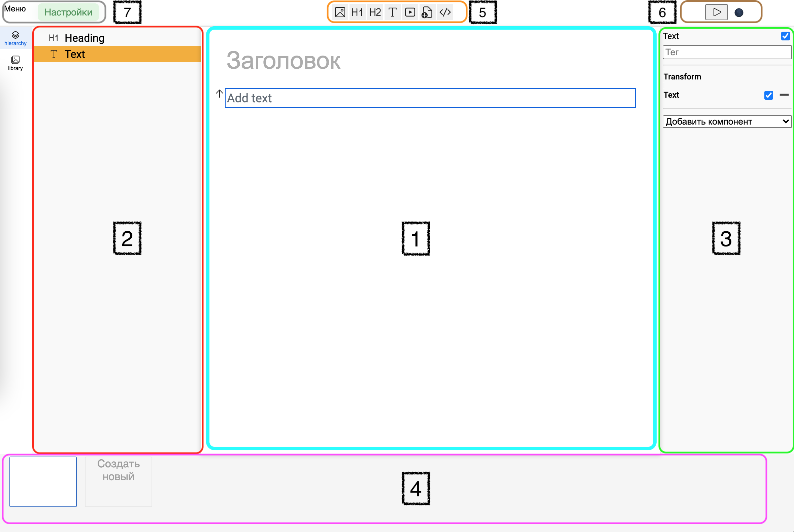

# Краткий обзор редактора

1. Рабочая область
2. Панель слоёв / иерархии (красная)
3. Панель свойств (зелёная)
4. Панель слайдов (фиолетовая)
5. Панель объектов (оранжевая)
6. Управляющие кнопки (перейти в режим проигрывания, сменить тему) (коричневая)
7. Настройки и Меню (серая)

## 1. Рабочая область

Отображает содержимое слайда, позволяет быстро выбрать и отредактировать объект.

## 2. Панель слоёв / иерархии

Отображает в компактном виде все объекты на сцене, а так же их взаимосвязь родитель-ребёнок.

Позволяет изменить вложенность или последовательность объектов (D&D).

**ПКМ по объекту** открываем меню управления объектом.

**ПКМ по панели** - доп. действия.

## 3. Панель свойств

Позволяет осуществить более гибкую настройку объекта:

- управлять тегами;
- управлять компонентами.

## 4. Панель слайдов

Содержит все слайды. Позволяет создать новый или удалить существующий. А так же изменить последовательность слайдов(D&D).

## 5. Панель объектов

Позволяет быстро создать необходимый объект:

- Заголовок
- Подзаголовок
- Текст
- Изображение
- Видео
- Аудио
- Схема
- Код

## 6. Управляющие кнопки

Позволяют перейти в режим проигрывания или переключить тему.

## 7. Настройки и Меню

Меню и настройки.
