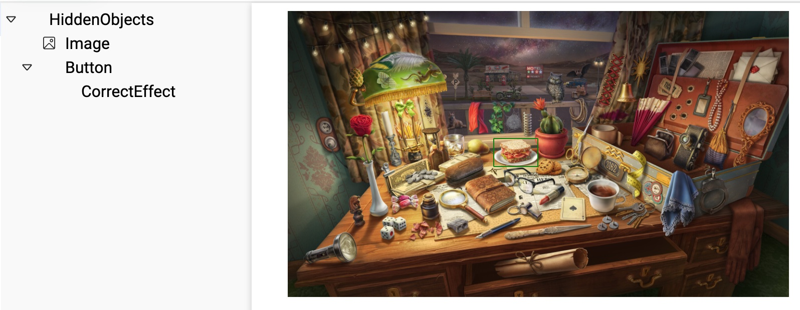

# Задание "Найди объект"

## Как сделать

Создаем необходимую структуру:

- HiddenObjects
  - Image
  - Button
    - CorrectEffect

Объект **HiddenObjects**

Transform:

- `position -> relative`
- `width -> 100%`
- `maxWidth -> X`, где X - максимальная ширина.

Объект **Image**

Transform:

- `width -> 100%`
- `mt, mb, ml, mr -> 0`, т.е. сбрасываем отступы
- задать `AspectRatio`, обычно автоматически заполняется если выбрать картинку.

:::caution Пока не работает

Надо добавить `line-height: 0` чтобы хорошо выглядело при изменении размера шрифта.

:::

Image:

- выбираем необходимое изображение

Button:

Компонент нужен, чтобы курсор менялся при наведении на все изображение.

Объект **Button**

Transform:

- `position -> absolute`
- `left, right, top, bottom -> X%`, где X - необходимое значение. Обязательно единицы измерения в процентах, чтобы при изменении размера изображения "зона клика" не сползала.

Button:

Чтобы обрабатывать щелчек + курсор.

CorrectedButton:

Чтобы выводить эффект и осуществлять переход на след. слайд.

- `correctEffect -> CorrectEffect(объект)`
- `isCorrect -> true`
- `goToNextWhenCorrect -> false`, но тут по желанию. Если нужно переходить на след. слайд, то включаем.

Объект **CorrectEffect**

Любой эффект, который необходимо отображить при нажатии на зону. В данном примере, отобразиться зеленая рамка вокруг зоны.

Transform:

- `position -> absolute`
- `left, right, top, bottom -> 0`

Border:

- `border -> 1px solid green`
- `borderRadius -> 1px`
