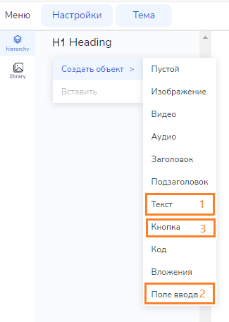

# Поле ввода с проверкой ответа

В этой инструкции пойдёт речь о том, как создать собственную механику для проверки ответов ученика.

## Создание

Для создания данной механики нам понадобятся четыре объекта:

* Текст,
* Поле ввода,
* Две кнопки (для проверки ответа и для сброса).

Воспользовавшись контекстным меню, поместим эти объекты на слайд:

клик ПКМ по панели иерархии > Создать объект > Название объекта

## Дерево объектов

Далее, создаём пустой объект, который в дальнейшем будет играть роль “обёртки” для всей нашей механики.

Мышью на панели иерархии перетаскиваем текст, поле ввода и кнопки внутрь пустого объекта.

Для удобства переименуем объекты: например, переименуем объект Empty в “Check”, а кнопки назовём “Check Button” и “Reset Button”.

Создадим ещё один пустой объект, переименуем его в Question и перенесём в него текст и поле ввода. В результате должно получиться такое дерево объектов:

* Объект
  * Question
    * Text
    * Input
  * CheckButton
  * ResetButton

**Question** - контейнер с заданием.

**Text** -  текст задания.

**Input** - поле ввода ответа.

**CheckButton** - кнопка проверки.

**ResetButton** - кнопка сброса.

## Содержимое и внешний вид

Сейчас на слайде наши объекты выглядят так:

Введём текст вопроса и поменяем надписи на кнопках. Для примера разберём вариант, когда учащемуся нужно решить уравнение и ввести ответ.

Кнопки по умолчанию растянуты на всю ширину и не имеют отступов. В нашем случае это смотрится не очень хорошо. Освоив приёмы выравнивания и позиционирования объектов, вы сможете разместить и выровнять объекты для своей механики любым предпочитаемым способом. Мы разберём лишь один классический пример.

Воспользовавшись компонентом Transform на панели свойств зададим для каждой кнопки свойство ** maxWidth **.

> ** maxWidth ** - это максимальная ширина объекта. Установка этого свойства означает, что объект не будет растягиваться в ширину больше указанной величины. Желательно указывать эту величину в * em *, а не в px, чтобы размер кнопки менялся в зависимости от установленного размера шрифта (1em равен размеру установленного шрифта).

Аналогичным способом можно по желанию поменять ширину и у поля ввода.

Теперь займёмся расстоянием между объектами. 
Для объекта Check, оборачивающего нашу механику, в компоненте Transform сменим тип отображения с * block * на * flex *. 

В результате у объекта появится панель с дополнительными настройками выравнивания содержимого. Воспользуемся этой панелью, и установим желаемый промежуток между вложенными объектами.

## Свойства поля ввода

У поля ввода на панели свойств есть компонент ** Input **, имеющий следующие свойства:

* value,
* type,
* readonly.

** value **

Значение, которое по умолчанию изначально будет находиться в поле ввода. В нашем случае это свойство нужно оставить пустым.

** type **

Тип вводимых данных. Может принимать значения:

* String - текстовая строка,
* Number - число.

Ответом в нашем задании будет число, поэтому мы выберем *Number*.

** readonly **

Поле только для чтения. При установке данной опции поле будет заблокировано от ввода. Сейчас нам это не понадобится.

## Проверка ответа

На панели свойств добавляем объекту Input компонент ** CheckInputValue **.

Компонент CheckInputValue предназначен для проверки полей ввода. Мы могли бы добавить компонент CheckInputValue любому объекту. Принцип работы компонента от этого не изменится. Мы лишь для удобства добавили его именно полю ввода, которое собираемся проверять.

CheckInputValue имеет следующие свойства:

* input,
* validValues,
* checkButton,
* resetButton,
* blockMode.

** input **

Здесь задаётся поле ввода, которое мы будем проверять. По умолчанию поле ввода не выбрано (None). Зададим поле ввода, которое хотим проверять:

Клик по значку с папкой > Выбрать нужный Input в появившемся окне.

** validValues **

Список значений, которые будут считаться правильными. Здесь может быть как одно значение, так и несколько. Например, если правильным ответом является слово “переменная”, то, вероятно, стоит учесть и внести в список правильных все варианты написания: “переменная”, “Переменная”, “ПЕРЕМЕННАЯ”.

Развернём список значений, кликнув по треугольнику слева от названия свойства.

По умолчанию этот список пуст. Кликнув на плюс, добавим правильный ответ. В нашем случае он будет всего один - число 90.

** checkButton и resetButton **

В этих свойствах задаётся кнопка, которая будет использоваться для проверки, и кнопка для сброса.

Кликнув по значку с папкой выберем для каждого из этих свойств соответствующую кнопку в появившемся окне.

** blockMode **

Меняет режим перехода на следующий слайд.

* None (по умолчанию) - ответ никак не влияет на переход к следующему слайду. 
* Finished - переход к следующему слайду возможен только после того как ответ дан, независимо от правильности.
* Solved - переход к следующему слайду возможен только после верного ответа.

## Проверка нескольких инпутов

Усовершенствуем нашу механику, добавив несколько заданий. Проще всего это сделать продублировав объект Question:

клик ПКМ по объекту Question на панели иерархии > Дублировать

Для удобства переименуем объекты в Question1, Question2 и т.д. А поля ввода переименуем, соответственно, в Input1, Input2 и тд.

Меняем тексты продублированных заданий:

И не забываем поменять у полей ввода в компоненте CheckInputValue проверяемые инпуты и правильные ответы.

В режиме проигрывания результат выглядит так:

Сейчас кнопка “Проверить” у нас всего одна, и она проверяет значения во всех инпутах сразу, подсвечивая правильные и неправильные ответы.

Но есть возможность сделать для каждого вопроса отдельную кнопку “Проверить”. Для этого продублируем CheckButton и разместим в иерархии после каждого вопроса.

Для каждого вопроса в компоненте CheckInputValue выберем соответствующую кнопку в свойстве checkButton.

Теперь ученик имеет возможность проверять каждое задание отдельно по мере выполнения.

## Примеры заданий

Добавляя в дерево объектов картинки, аудио, видео и другие объекты, можно создавать различные типы заданий. Вот некоторые примеры заданий.

### Пример 1. Аудирование

** Дерево объектов **

### Пример 2. Вставь пропущенные буквы (слова)

** Дерево объектов **

** Примечание **

В этом примере тексты и поля ввода расположены в одной строке. Чтобы этого добиться для объекта Question на панели свойств в компоненте Transform нужно установить Отображение: flex, и на всплывающей панели выбрать Направление: Horizontal.

### Пример 3. Подпиши части

** Дерево объектов **

