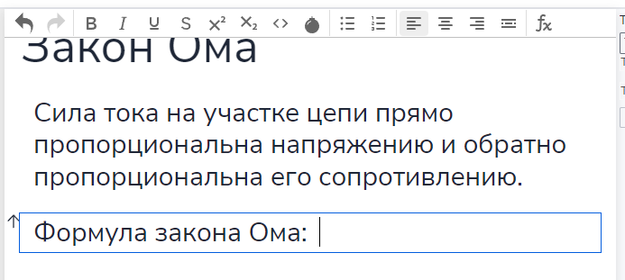
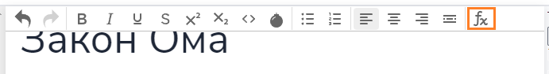
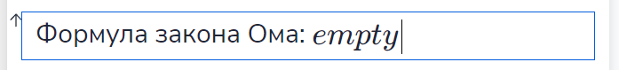
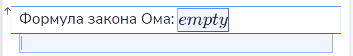
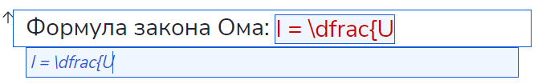
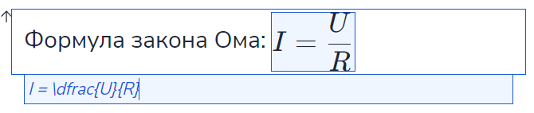
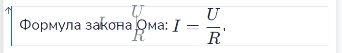
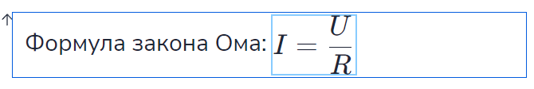
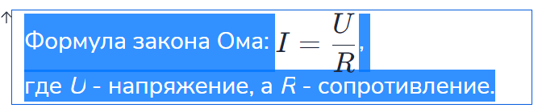

# Формулы в тексте

## Создание

Перемещаем курсор в то место текста, куда хотим вставить формулу.

Для вставки формулы кликаем на пункт “fx” в меню на панели редактирования текста.

В тексте появится пустая формула.

## Редактирование формулы

При клике по формуле под нею появляется поле редактирования. 

В это поле необходимо ввести формулу, используя функции специального синтаксиса ** KaTex **. KaTex имеет очень широкий спектр возможностей для написания математических формул и символов. 

Для примера напишем формулу закона Ома.

Если функция KaTex ещё не дописана, либо введена с ошибками, то в формуле текст будет выделен красным цветом. 

Как только функция KaTex будет дописана, она моментально преобразуется в формулу.

Убираем фокус с поля редактирования формулы, кликнув в другом месте, и наслаждаемся результатом.

## Все функции KaTex

Полный справочник функций, поддерживаемых KaTex можно посмотреть здесь: https://katex.org/docs/supported.html

## Перетаскивание, копирование и удаление формул

### Перетаскивание

Готовую формулу можно переместить в любое место текста. Для этого достаточно просто перетащить её мышью.

При перетаскивании формулы в другой текстовый блок происходит её копирование.

### Выделение

Для выделения формулы нужно зажать на ней клавишу мыши, слегка переместить формулу в сторону и отпустить. Вокруг формулы появится светлая рамка. Это означает, что формула выделена.

При выделении текста формула выделяется вместе с ним, хоть этого и не видно. 

### Копирование

Для копирования нужно выделить формулу, как показано выше и нажать CTRL+C. Скопированную формулу можно вставить в любой текстовый блок с помощью CTRL+V.

Чтобы создать копию формулы в пределах одного слайда, можно перетащить её мышью, удерживая клавишу CTRL.

При перетаскивании формулы в другой текстовый блок удерживать CTRL не обязательно, так как копирование в этом случае происходит автоматически.

При копировании и вставке фрагмента текста, имеющиеся в тексте формулы тоже будут успешно скопированы и вставлены. Но только в пределах редактора материалов. При вставке скопированного текста в другой текстовый редактор (например, MS Word) формулы не переносятся.

### Удаление

Для удаления формулы необходимо поставить курсор слева или справа от неё и нажать соответственно DELETE или BACKSPACE.

Либо выделить формулу, как было показано выше, и и нажать DELETE или BACKSPACE.

