# Создание теста

Для создания теста используется объект c компонентом ** M-Quiz **.

## Создание

Для начала, создадим пустой объект: 

клик ПКМ по панели иерархии > Создать объект > Пустой.

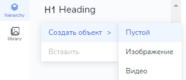

Созданный пустой объект можно переименовать на своё усмотрение:

клик ПКМ по объекту на панели иерархии > Переименовать.

Например, назовём его Quiz.

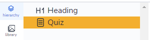

Используя панель свойств, добавляем к объекту компонент M-Quiz:

Панель свойств > Добавить компонент > M-Quiz

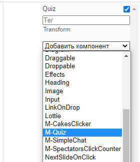

** Альтернативный более простой способ создания теста: **

Меню > Механики > Тест

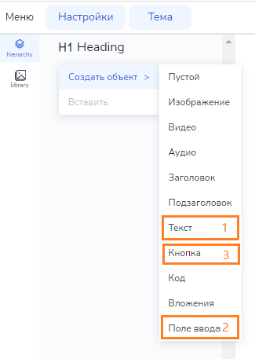

## Редактор M-Quiz

У компонента M-Quiz имеется свой редактор. Для перехода в редактор компонента необходимо кликнуть по букве E на панели свойств напротив названия компонента.

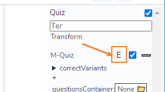

В открывшемся редакторе кликаем “Добавить вопрос”.

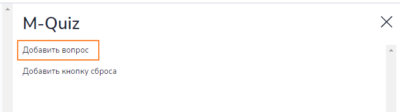

Появится панель редактирования вопроса, на которой есть поле для ввода задания и кнопки “Удалить” и “Добавить вариант”. 

Введём текст задания.

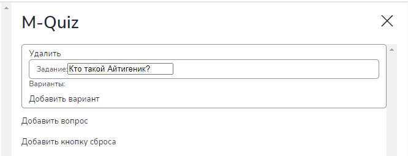

Используя кнопку “Добавить вариант”, создадим несколько вариантов ответа. Правильный ответ отмечаем галочкой. 

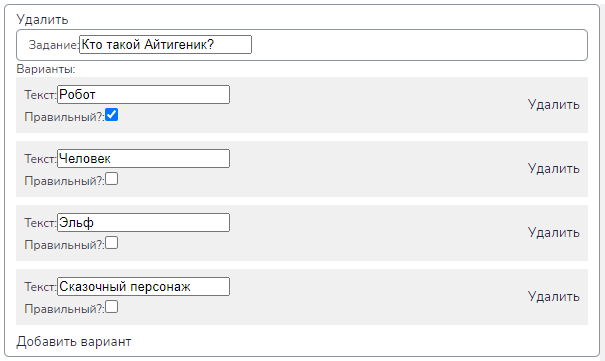

Правильных ответов может быть несколько. Например, добавим ещё одно задание и сделаем для него несколько правильных вариантов ответа.

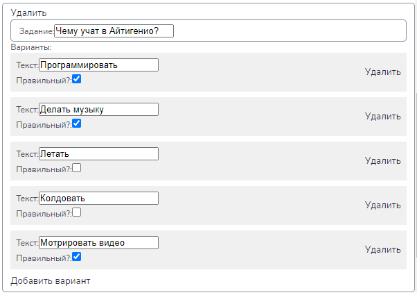

Если планируется дать возможность учащемуся проходить тест многократно, то следует добавить кнопку сброса.

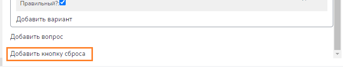

По окончанию редактирования теста редактор M-Quiz следует закрыть, кликнув на крестик справа. 

После закрытия редактора в рабочей области мы сможем увидеть, как будет выглядеть наш тест.

## Структура объекта

На панели иерархии видно, что объект, в который мы добавили тест, приобрёл сложную структуру. Рассмотрим её.

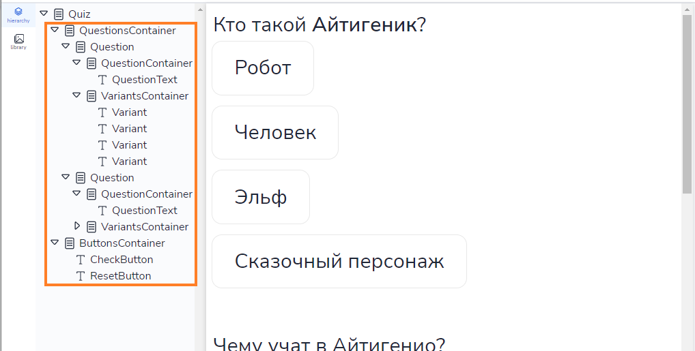

* Объект
  * QuestionsContainer
    * Question
      * QuestionContainer
        * QuestionText
      * VariantsContainer
        * Variant
        * …
    * …
  * ButtonsContainer
    * CheckButton
    * ResetButton

** QuestionsContainer ** - контейнер, содержащий все вопросы теста.

** Question ** - объект, содержащий задание теста вместе с вариантами ответа.

** QuestionContainer ** - контейнер с тестом вопроса.

** QuestionText ** - текст вопроса.

** VariantsContainer ** - контейнер с вариантами ответа.

** Variant ** - текст варианта ответа.

** ButtonsContainer ** - контейнер с управляющими кнопками для теста.

** CheckButton ** - кнопка проверки”.

** ResetButton ** - кнопка сброса (если была добавлена).

Допускается редактирование и форматировние каждого из дочерних объектов. Например, выделим в первом вопросе слово “Айтигеник” полужирным. 

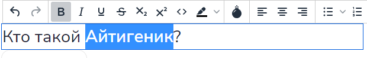

Все контейнеры в структуре объекта являются объектами FlexGroup, поэтому на всплывающей панели для них доступны соответствующие опции для выравнивания.

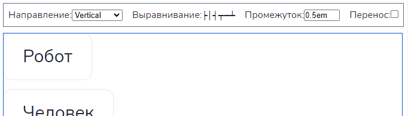

## Настройки компонента

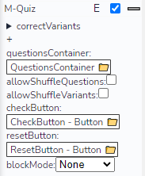

На панели свойств для компонента M-Quiz доступны следующие настройки:

* allowShuffleQuestions
* allowShuffleVariants
* blockMode

** allowShuffleQuestions **

Если опция включена, то вопросы теста в режиме воспроизведения материала будут иметь случайный порядок.

** allowShuffleVariants **

Если данная опция включена, то варианты ответов в режиме воспроизведения будет иметь случайный порядок.

** blockMode **

Разрешает либо блокирует перехд к следующему с лайду в зависимости от прохождения теста.

* ** None ** (по умолчанию) - прохождение теста никак не влияет на переход к следующему слайду. 
* ** Finished ** - переход к следующему слайду возможен только после прохождения теста, не зависимо от результата.
* ** Solved ** - переход к следующему слайду возможен только после верного прохождения теста.

## Картинки в вопросах

Создадим новое задание, подразумевающее наличие картинки.

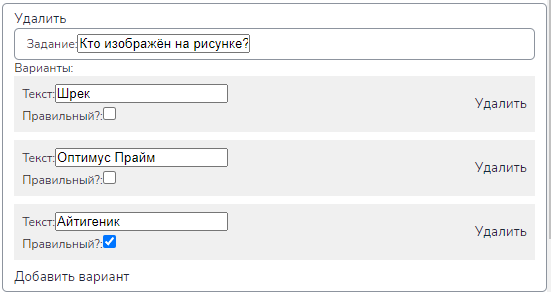

Выходим из редактора M-Quiz.

Воспользовавшись панелью объектов вставляем подходящее изображение и настраиваем его размер при необходимости.

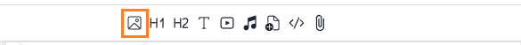

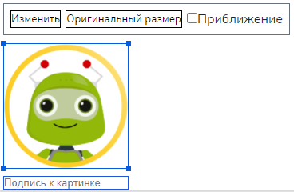

На панели иерархии перетаскиваем объект Image внутрь объекта QuestionContainer.

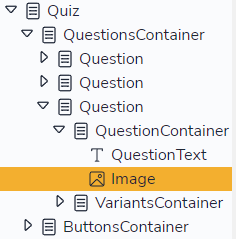

Результат

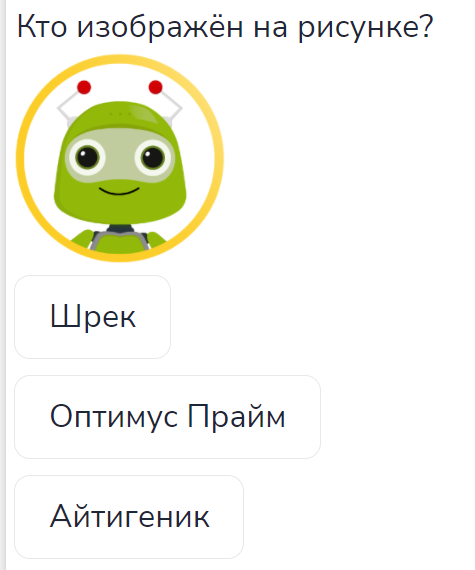

## Картинки вместо текста в ответах

:::caution Временно 

Данный способ вставки изображений в ответы является временным решением. Позже эта возможность будет заложена в самом редакторе M-Quiz.

:::

Создадим ещё одно задание, подразумевающее выбор правильной картинки.

Добавляем варианты ответа и отмечаем правильный. Тектовые поля вариантов можно не заполнять, так как мы собираемся вставлять в них картинки.

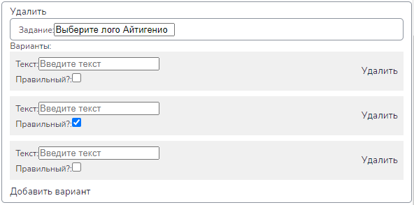

Закрываем редактор M-Quiz.

Выбираем в рабочей области либо в иерархии объект с вариантом ответа.

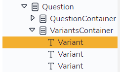

На панели свойств добавляем к объекту компонент Image:

Панель свойств > Добавить компонент > Image

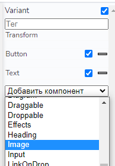

Кликаем “Изменить” на всплывающей панели, загружаем изображение и настраиваем его размер при необходимости.

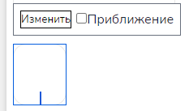

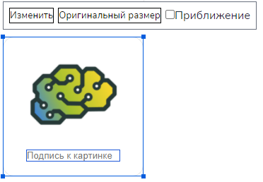

Подобным оразом вставляем картинки для остальных вариантов ответа.

Для более компактного отображения выберем для VariantsContainer направление Horizontal и выровняем размер картинок, чтобы варианты были одинаковой высоты. Если вариантов много, следует отметить галочку “Перенос”.

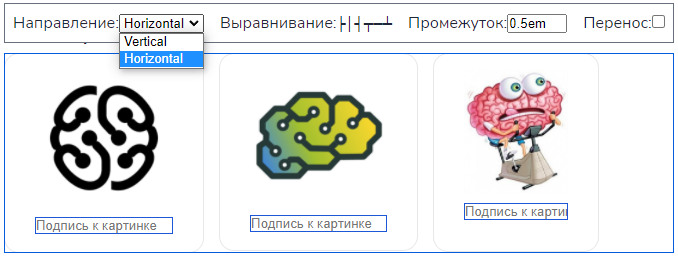

В режиме просмотра это будет выглядеть так.

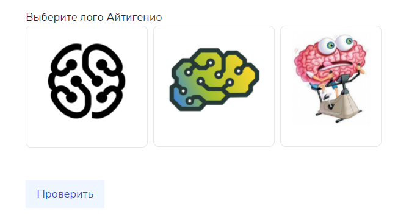